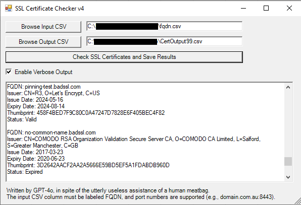

# SSL Certificate Checker GUI
GUI-based SSL Certificate Checker and Validator using PowerShell. Check the SSL status, issuer, issue/expiry dates, and thumbprint of certificates for multiple domains sourced from a CSV file.

## Features

- **GUI Interface:** Easy-to-use graphical user interface for checking SSL certificates.
- **CSV Input/Output:** Import domains from a CSV file and export the results to another CSV file.
- **Detailed Information:** Provides issuer, issue date, expiry date, thumbprint, and status of certificates.
- **Verbose Output:** Option to enable verbose output for detailed logs.

## Screenshot



## Requirements

- Windows operating system
- PowerShell
- .NET Framework

## Installation

1. Clone this repository to your local machine:
    ```sh
    git clone https://github.com/natejperez1/CertCheckGUI.git
    ```

2. Open PowerShell and navigate to the cloned repository folder:
    ```sh
    cd path\to\CertCheckGUI
    ```

3. Run the script:
    ```sh
    .\CertCheckGUI.ps1
    ```

## Usage

1. Create a MS-DOS CSV with a single column labelled "FQDN"
2. Click on the "Browse Input CSV" button to select the CSV file containing the domains.
3. Click on the "Browse Output CSV" button to select the destination for the output file.
4. Optionally, check the "Enable Verbose Output" for more detailed information.
5. Click the "Check SSL Certificates and Save Results" button to start the scanning process.

## Contributing

Contributions are welcome!

## License

This project is licensed under the GPL License. See the [LICENSE](LICENSE) file for details.

## Author

Written by GPT-4o. Keyboard tapping and mouse clicking by Nate Perez
